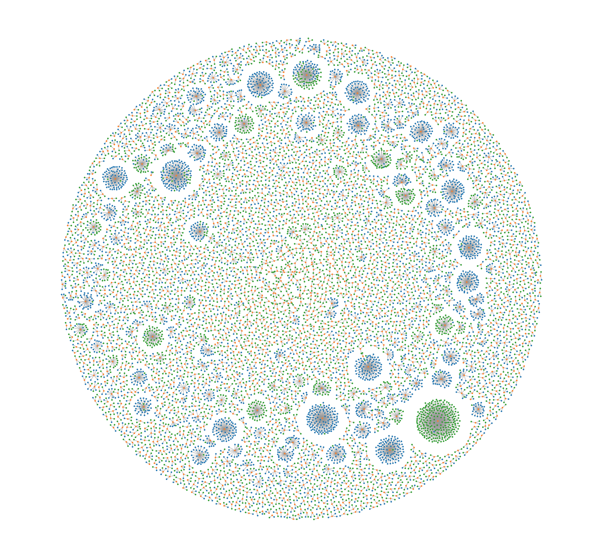
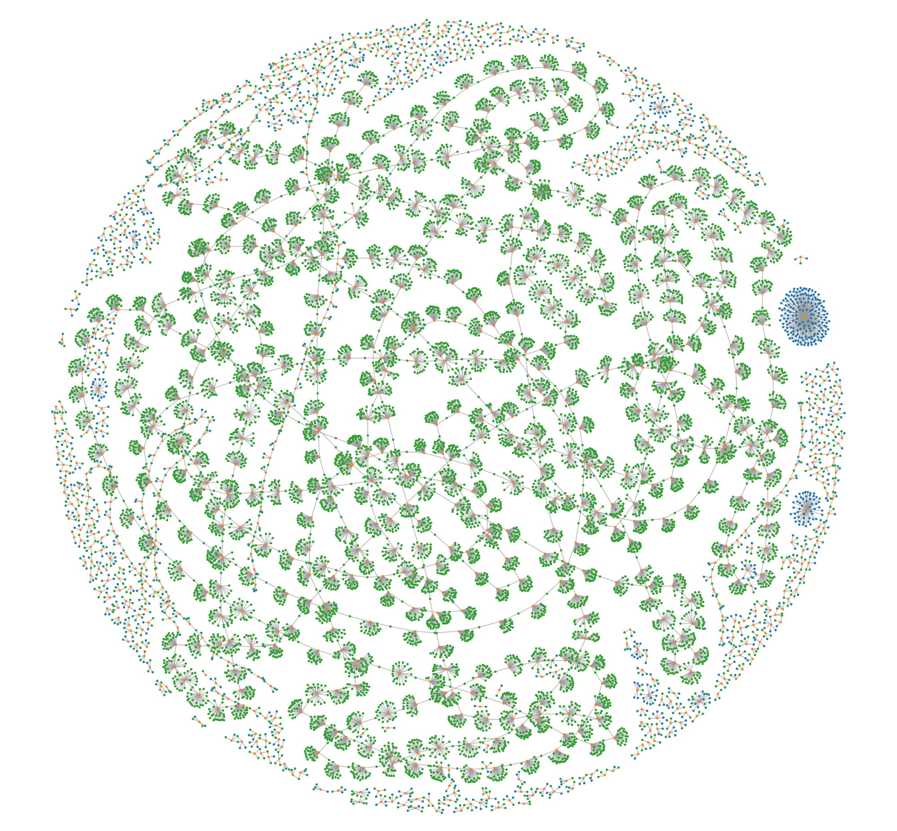
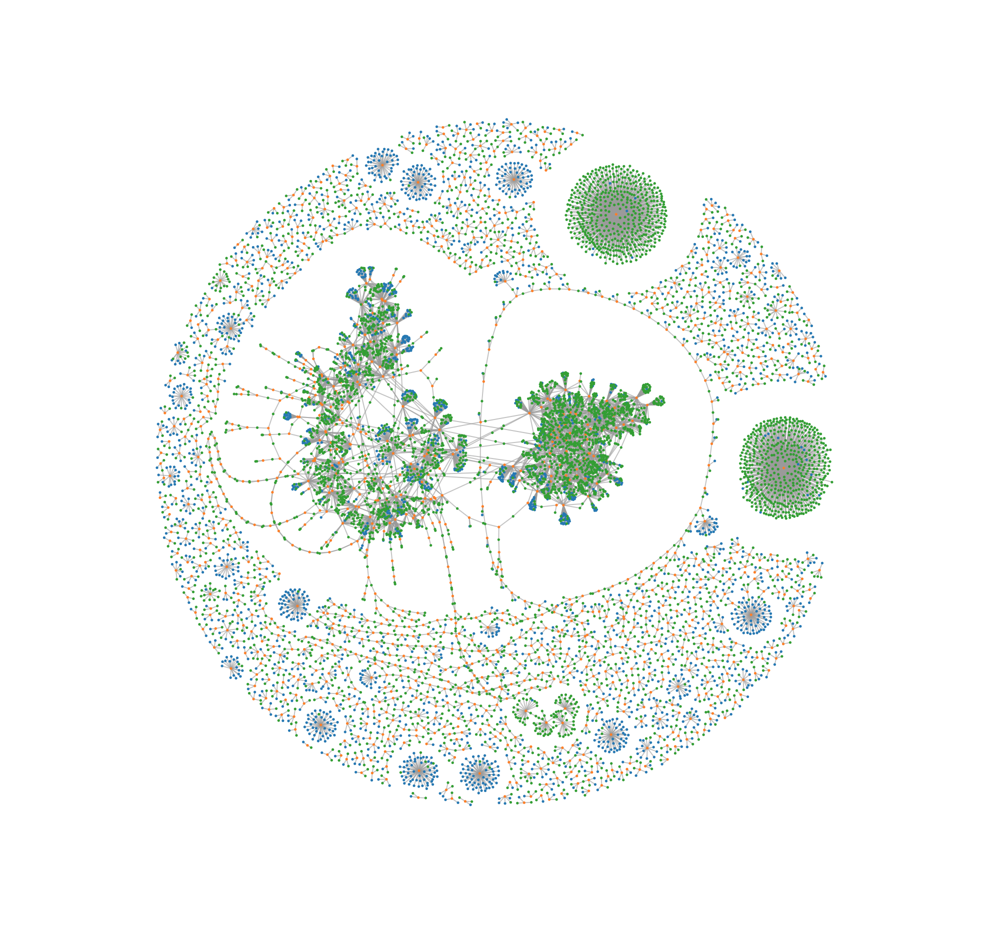

# Bitcoin Bloc Visualisation

## Output

### Regular Block

Block #495185 - 000000000000000000bd766afa5808a25c4f7b5f1d7102e2fa9d7becefb34d09

### Parasite Attack

Block #364618 - 00000000000000000a529be68d2cfb3eb80cfd91ce75c4e0aacd388fbe2aa883

### Attack ???

Block #364608 - 00000000000000000549f8d5cfd9037b4b2f10cbba695a40e537b179af8d6fae

### Multiple Render

(aggregate on Photoshop)

## Run the code

`jupyter notebook`

Install the python dependencies:

- selenium
- urllib
- pickle

JS dependencies lib are included.

Run `python -m SimpleHTTPServer` or `python -m http.server`  
Check `localhost:8000` to be sure that you have `20nov.html` and that you can render the graph.

Open `20 nov - Bunch of Blocks2` notebook and follow the step by step process.

Add the hash of the block you want to start with in  
`BLOCKS_INIT = '0000000000000000005d1bafc5ce58c1dff2a58bfed50896e880c6e70697d36e'`

Run it!  

